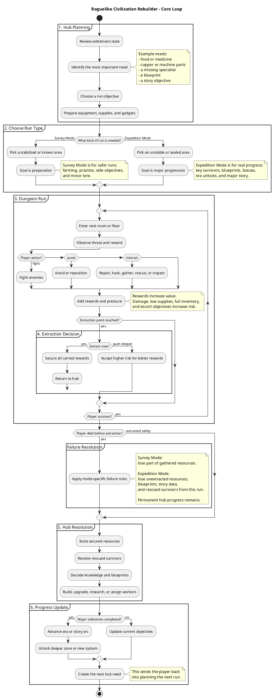

# Core Loop

## Purpose

This document explains the main player cycle of the game. It should be the reference point for every other system: hub management, dungeon exploration, progression, survivors, resources, knowledge, failure, and story rewards.

The core loop must stay simple enough to understand in one sentence, but rich enough to support many runs:

> Go down, bring value back, build upward, go deeper.

## Design Goal

The game is built around the connection between a dangerous roguelike dungeon and a growing civilization hub.

Inside **The Cradle**, the player takes risks. They explore floors, fight or avoid enemies, gather materials, rescue survivors, recover blueprints, and decide when to extract. The dungeon is where uncertainty, danger, and discovery happen.

Back in the hub, the player turns those discoveries into permanent progress. Extracted resources become buildings, rescued survivors become workers or specialists, recovered knowledge becomes technology, and new infrastructure opens deeper objectives.

The important design principle is that neither side should feel optional. The dungeon gives the player things worth saving. The hub gives those things meaning.

## Core Experience

Each cycle begins with a need in the settlement. The hub may need food, medicine, copper, a generator part, a specialist, or a specific blueprint. That need gives the next dungeon run a clear reason to exist.

The player prepares for the run by choosing equipment, tools, healing items, gadgets, and a dungeon mode. **Survey Mode** is used when the player wants lower-risk materials, practice, or minor discoveries. **Expedition Mode** is used when the player wants true progress: new technologies, key survivors, era advancement, bosses, and major story discoveries.

Once inside The Cradle, the player explores floor by floor. Each room should create a decision: fight, avoid, gather, repair, rescue, spend a resource, open a risky chamber, or move on. As the player collects more valuable rewards, the run becomes more tense because those rewards are not truly owned until extraction.

Extraction is the central pressure point. At each extraction opportunity, the player must decide whether to return safely with what they have or push deeper for better rewards. The longer they continue, the more valuable the run becomes and the more painful failure will feel.

When the player extracts successfully, the game returns to the hub. This is where the run pays off. Resources are stored, survivors are assigned, knowledge is decoded, buildings are upgraded, and new objectives appear. The next run should feel different because the settlement has changed.

## Loop Structure

```text
Hub need appears
-> Player prepares for a run
-> Player chooses Survey Mode or Expedition Mode
-> Player enters The Cradle
-> Player explores, fights, gathers, rescues, and discovers
-> Player reaches an extraction decision
-> Player extracts safely or pushes deeper
-> Extracted rewards improve the hub
-> Hub upgrades unlock new tools, needs, and deeper objectives
-> Player prepares for the next run
```

This structure should be visible to the player at all times. They should understand what they are trying to get, why it matters, and what will change if they succeed.

## PlantUML Flow

The diagram below shows the loop as six phases. The important part is not the exact number of rooms or floors, but the cause-and-effect chain: the hub creates a need, the dungeon creates risk, extraction secures value, and the hub turns that value into progress.



## Player Motivation

The player should never enter the dungeon only because the game says so. A good run starts with a concrete reason: the clinic needs medicinal fungus, the forge needs copper, a survivor heard a signal from Floor 20, or the generator requires a damaged memory core.

The motivation chain should be clear:

```text
Need -> Run objective -> Risk -> Extraction -> Hub change -> New need
```

This chain is what makes the game feel like a civilization rebuilder instead of a disconnected dungeon crawler. The player is not collecting loot for its own sake. They are bringing back the material, human, and intellectual pieces required to rebuild society.

## Success and Failure

Success should create visible change. A good extraction should let the player build something, repair something, assign someone, unlock a recipe, open a zone, or reveal a story fragment. Even small rewards should make the settlement feel more alive.

Failure should hurt, but it should not erase the player's desire to continue. The player may lose unextracted materials, blueprints, or rescued survivors from that run, especially in Expedition Mode. However, previously secured hub upgrades, rescued people, unlocked knowledge, and permanent era progress should remain safe.

This keeps the tension sharp without making the game feel hostile. The player should think, "I lost that run because I pushed too far," not "the game wasted my time."

## Design Rules

The dungeon should create valuable uncertainty, while the hub should create meaningful direction. Hub needs should generate run objectives, and dungeon discoveries should generate hub decisions.

Every extracted reward should have a purpose. Common resources should remain useful later as ingredients in more advanced systems, and rare discoveries should create immediate excitement because they unlock new choices.

The best rewards should require risk, but risk must be readable. The player should usually understand what they are gambling before they decide to continue deeper.

Most importantly, the loop should change the game state after every successful run. If the player returns to the hub and nothing meaningful changes, the loop has failed.

## Clean Loop Statement

The player prepares in a growing human hub, descends into The Cradle to recover resources, survivors, and knowledge, chooses whether to extract safely or risk going deeper, then uses everything secured to rebuild civilization and unlock stronger tools, deeper zones, and new story discoveries.
