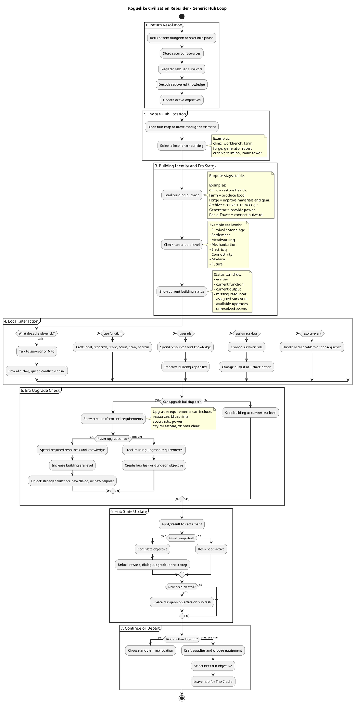

# Hub Loop

## Purpose

The hub is the strategic and emotional center of the game. It is where dungeon rewards become civilization progress, where survivors become part of the settlement, and where the next expedition gets its purpose.

The hub should not be treated as a static menu. It should work like a growing network of locations. Each location or building can offer a small interaction, a dialog, a function, an upgrade, a survivor assignment, or a new objective.

The hub answers the question:

> What do I do with what I brought back?

## Hub Fantasy

The hub begins as a damaged shelter and slowly becomes a living settlement. Its growth should be visible, practical, and emotional. At first, the player may only have a broken capsule, a workbench, storage, and a damaged generator. Later, the same space can include a clinic, farm, forge, research station, housing, radio tower, and active NPCs.

The player should feel that the hub is not only a place to spend resources. It is the visible proof that humanity is returning.

## Generic Hub Location Model

Every hub location should follow the same general structure, even if each one has different content.

A location can show the player its current state, present one or more characters, offer local actions, expose upgrades, and generate needs. This keeps the hub scalable: a clinic, farm, workbench, generator room, archive terminal, and radio tower can all use the same interaction logic while still feeling different.

Each location should also have an era identity. The building's core purpose remains stable, but its form and output improve as civilization advances. A food building may begin as a foraging station, become a farm, later become an automated greenhouse, and eventually become a future biotech food system. This gives the hub a clear long-term progression path without changing the player's basic understanding of what the building is for.

The generic model is:

```text
Enter location
-> Read current state
-> Talk or inspect
-> Choose local action
-> Spend resources, assign survivor, or resolve event
-> Update hub state
-> Create or complete objective
```

For example, the clinic may offer healing, medical dialog, disease events, medicine crafting, and a request for medicinal fungus. The forge may offer weapon upgrades, material processing, blacksmith dialog, and a request for copper. The radio tower may offer signal scanning, story messages, technician dialog, and a request for power or antenna parts.

## Child Design Documents

The hub loop has several child documents. Each one defines a specific part of how hub locations, buildings, NPCs, upgrades, and requests should work.

| File | Covers |
| --- | --- |
| [Hub Location Template](Hub%20Loop/Hub%20Location%20Template.md) | Shared schema for every hub building or location. |
| [Building Purpose and Era Levels](Hub%20Loop/Building%20Purpose%20and%20Era%20Levels.md) | How each building evolves from early survival forms to future forms. |
| [Upgrade Requirements](Hub%20Loop/Upgrade%20Requirements.md) | Resources, knowledge, survivors, milestones, and dependencies needed for upgrades. |
| [Location Interaction Rules](Hub%20Loop/Location%20Interaction%20Rules.md) | How status, functions, dialog, upgrades, assignments, and events appear in a location. |
| [NPC and Dialog Behavior](Hub%20Loop/NPC%20and%20Dialog%20Behavior.md) | Contextual dialog rules for survivors and story NPCs. |
| [Requests and Dungeon Objectives](Hub%20Loop/Requests%20and%20Dungeon%20Objectives.md) | How hub needs become dungeon objectives and resolve back into hub progress. |
| [Hub Events and Consequences](Hub%20Loop/Hub%20Events%20and%20Consequences.md) | Small settlement events caused by needs, failures, milestones, or NPC conflicts. |
| [First Prototype Hub Scope](Hub%20Loop/First%20Prototype%20Hub%20Scope.md) | The minimal hub needed to test the first playable loop. |

## Location Interaction Types

Each building does not need many systems at once. A location can start simple and gain more interactions as the hub develops.

Common interaction types:

| Interaction | Meaning |
| --- | --- |
| Status | Shows what the location is doing, missing, producing, or blocking. |
| Dialog | Lets the player talk to assigned survivors or story NPCs. |
| Function | Performs the building's main action, such as healing, crafting, research, storage, or scouting. |
| Upgrade | Improves the building by spending resources and knowledge. |
| Assignment | Lets the player assign a survivor to change output or unlock options. |
| Request | Creates a dungeon objective based on a local need. |
| Event | Resolves a problem, conflict, discovery, or consequence. |

This structure lets every hub location feel alive without requiring every building to become a complex minigame.

## Hub Categories

Hub locations should be grouped by what kind of civilization need they support.

| Category | Purpose | Example Locations |
| --- | --- | --- |
| Survival | Keeps people alive and stable. | Clinic, kitchen, water purifier, farm, housing. |
| Production | Turns materials into tools and infrastructure. | Workbench, forge, material processor, mechanical workshop. |
| Exploration | Helps the player plan and survive dungeon runs. | Map room, elevator station, extraction beacon, expedition terminal. |
| Combat | Improves defense and expedition combat readiness. | Armory, training area, gadget lab, defense post. |
| Knowledge | Converts discoveries into technology and story progress. | Archive terminal, research lab, school, blueprint station. |
| Power | Enables advanced systems and later hub stages. | Generator room, battery bank, power grid, machine room. |
| Connectivity | Opens communication beyond the settlement. | Radio tower, signal station, scanner array, communication terminal. |

Categories are mainly for clarity. The player should not feel like they are managing abstract tabs. They should feel like they are visiting useful places in a settlement.

## Hub Flow

A normal hub visit starts when the player returns from a run. The first step is resolution: extracted resources are stored, rescued survivors are registered, knowledge is decoded, and any active objectives are updated.

After that, the player moves through hub locations to decide what matters next. They may visit the clinic to heal, the workbench to craft, the archive to decode a memory core, the farm to check food, or the generator room to see what is missing for power restoration.

The visit should end with preparation. By the time the player leaves the hub, they should have a clear reason for the next run.

```text
Return from dungeon
-> Resolve rewards
-> Visit hub locations
-> Talk, inspect, craft, heal, assign, upgrade, or research
-> Identify the next need
-> Prepare supplies
-> Choose next run objective
-> Enter dungeon again
```

## PlantUML Flow

The diagram below shows the hub as a generic interaction network. It does not assume a specific building. Any location can plug into the same workflow.

Each building also has an **era level**. A clinic, farm, forge, archive terminal, or generator room should keep the same broad purpose across the whole game, but its function improves as civilization advances. For example, a healing location may begin as a campfire triage spot, become a clinic during the Settlement Era, become a powered medical station in the Electricity Era, and eventually become an advanced regeneration or bioengineering facility in a future era.

This means every building has three important questions:

- What is this building's purpose?
- What can it do in the current era?
- What does it need to upgrade into its next era form?



## Survivors in the Hub

Survivors are the main way the hub becomes personal. They should not only increase population. A survivor can unlock a building, improve a function, create a request, change dialog, or introduce a conflict.

For example, a doctor assigned to the clinic may improve healing and unlock medicine crafting. A farmer assigned to the farm may improve food production and create seed recovery objectives. A technician assigned to the generator room may unlock electrical research but request parts from deeper floors.

The important rule is that survivor assignment should create tradeoffs. A useful survivor may be able to work in several locations, but only one assignment should be active at a time.

## City Needs

City needs are the hub's pressure system. They make the settlement feel alive and generate practical reasons to enter the dungeon.

Food, health, knowledge, power, morale, and security can all create objectives. If the clinic lacks medicine, the player has a reason to search organic rooms. If the forge lacks copper, the player has a reason to enter metal-rich floors. If the archive has an unreadable memory core, the player may need a specialist or a better research station.

For the first prototype, the hub should use only a small set of needs:

| Need | Why It Matters |
| --- | --- |
| Population | Shows rescued humanity returning. |
| Food | Creates basic survival pressure. |
| Health | Supports recovery and expedition readiness. |
| Knowledge | Unlocks technologies and story. |
| Power | Drives the first major settlement milestone. |

More needs can be added later, but the first version should stay readable.

## Hub Growth

The hub should grow in stages. Each stage changes both gameplay and mood.

| Stage | Gameplay Meaning | Story Meaning |
| --- | --- | --- |
| Shelter | Basic crafting, storage, healing. | Humanity is barely alive. |
| Settlement | Housing, farming, clinic, jobs. | People begin trusting each other. |
| Industry | Forge, workshop, processing. | The community can create again. |
| Electricity | Generator, batteries, powered machines. | Light returns. |
| Connectivity | Radio tower, scanner, archive network. | The hub reaches beyond itself. |

Growth should not only add new menus. It should change what the player sees, who they can talk to, what sounds are present, what lights are active, and what problems the settlement can now face.

## Building Era Progression

Buildings should not be replaced by unrelated systems every era. They should evolve.

| Building Purpose | Early Form | Industrial / Modern Form | Future Form |
| --- | --- | --- | --- |
| Healing | Triage corner, herbal table, basic clinic. | Powered clinic, surgical station, diagnostic equipment. | Regeneration lab, bio-monitoring system, advanced medicine. |
| Food | Foraging storage, seed bed, basic farm. | Irrigated farm, greenhouse, food processing. | Automated hydroponics, bioengineered crops, nutrient synthesis. |
| Crafting | Workbench, hand tools, repair table. | Machine workshop, powered tools, fabrication line. | Nanofabricator, adaptive manufacturing, smart materials. |
| Materials | Stone store, scrap sorting, charcoal furnace. | Forge, refinery, material processor. | Molecular assembler, advanced alloy printer. |
| Knowledge | Damaged terminal, manual archive, teacher space. | Research lab, school, data recovery station. | Predictive archive, AI-assisted research, memory reconstruction. |
| Power | Campfire, hand crank, damaged generator. | Power grid, battery bank, turbine, reactor. | Fusion core, wireless power, exotic energy system. |
| Communication | Signal flags, basic radio, antenna. | Radio tower, scanner array, archive network. | Quantum relay, temporal signal system, inter-settlement network. |

This approach keeps the hub readable. The player can understand that "the clinic heals people" from the beginning, while still feeling that the clinic changes meaningfully as civilization climbs from primitive survival to advanced technology.

## Design Rules

A hub location should usually provide one clear function, one visible state, and one reason to care. It can gain more interactions later, but its first version should be easy to understand.

Buildings should create dungeon objectives, not just consume resources. If the player upgrades the generator, the next need might be batteries. If the radio tower comes online, the next need might be a signal amplifier or a rescue coordinate.

NPC dialog should support gameplay and story at the same time. A survivor should not only give flavor text; they can reveal a need, explain a system, request a resource, react to progress, or create tension.

The hub should always make the next run clearer. If the player finishes a hub visit without knowing why they are going back into The Cradle, the hub loop is not doing its job.

## Clean Hub Loop Statement

The player returns to the hub with secured rewards, visits settlement locations to talk, inspect, craft, heal, assign survivors, upgrade buildings, and resolve events, then leaves with a clear objective that sends them back into The Cradle.
